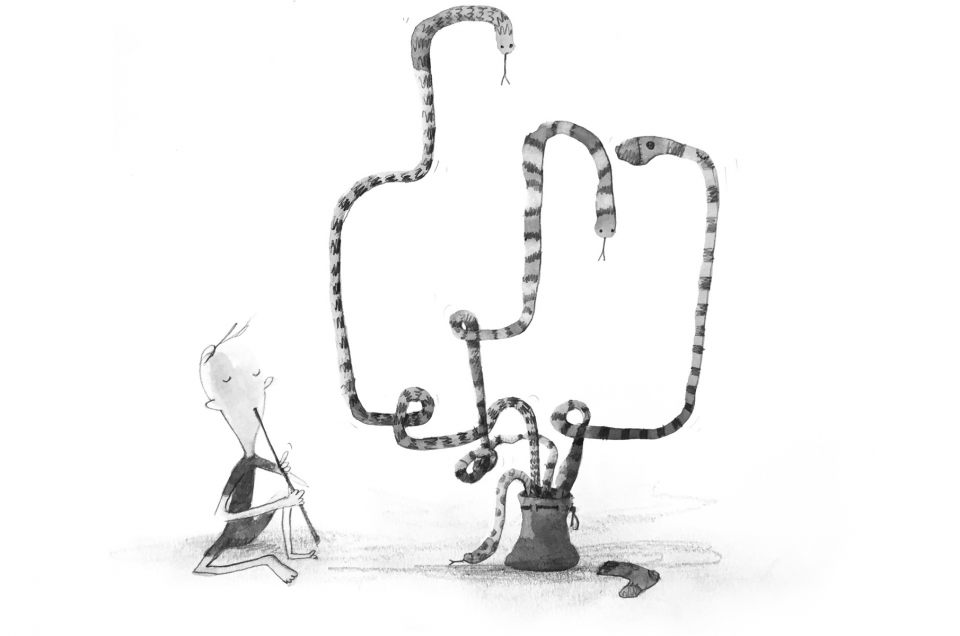

**Positioning 101**
Ejercicios de CSS y HTML.

Si eres un desarrollador front-end o un diseñador al que le gusta codificar, los diseños basados ​​en CSS son el núcleo de tu trabajo. 
En lo que podría ser un repaso para algunos, o incluso un "a-ha!" Para otros, miremos la propiedad de posición CSS para ver cómo podemos
usarla para crear diseños de CSS compatibles con los estándares y sin tablas.
(Introduccion a los ejercicios guiados de la pagina: https://alistapart.com/article/css-positioning-101)

